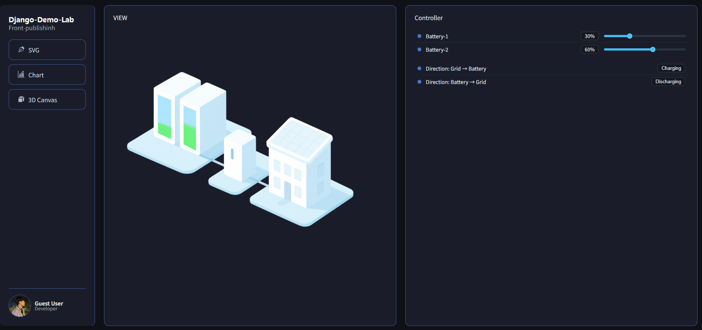
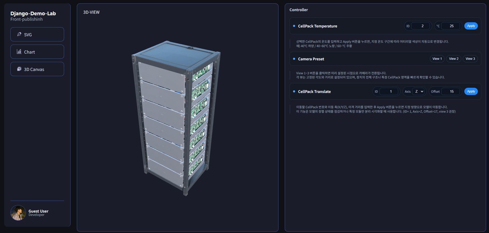
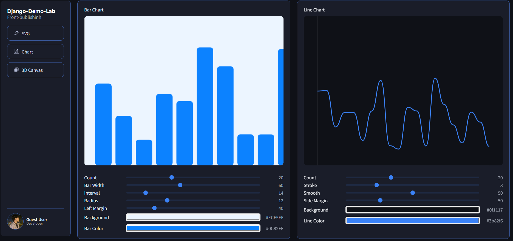

# 🧪 Django Demo Lab
**기능 단위별 실험 및 시각화 데모 레포지토리**

## 📘 개요
`django-demo-lab`은 재직 시 진행했던 **PCS-ESS 이상징후 관련 연구 과제**일환으로 수행했던 3D 퍼블리싱 작업 내용을 **디자인 리소스와 실사용 데이터를 제외하고 웹 기능 단위로 재현한 프로젝트**입니다.

> CodePen처럼 각 기능을 분리하고, PV–PCS–BAT의 데이터 플로우를  
> 독립적으로 시뮬레이션하며 시각화합니다.

🧩 구성
```
|-- README.md
|-- data-publisher/        # MQTT 및 가상 데이터 발행기 (개발 예정)
|-- django-web/
|   |-- config/            # Django 설정
|   |-- dashboard/         # 웹 시각화 앱 (main app)
|   |   ├── static/        # CSS, JS 리소스
|   |   ├── templates/     # HTML 템플릿
|   |   └── views.py       # 페이지 라우팅
|   |-- harvester/         # 데이터 수집 모듈 (미구현)
|   |-- readmeImage/       # README 내 이미지 리소스
|   └── requirements.txt   # 의존성
`-- infra/
    |-- broker/            # MQTT 브로커 (Mosquitto docker-compose)
    `-- influxdb/          # InfluxDB 1.x 설정 및 볼륨 구조
```

## 🌐 주요 페이지
### 1️⃣ SVG Interaction

단순 SVG 기반의 배터리 충전 흐름 및 양방향 상태 전환 데모



- 배터리 충전/방전 방향 전환 (Grid → Battery / Battery → Grid)
- 슬라이더로 충전량 조절
- 단일 <svg> 태그 내 동적 path 변경 및 fill-animation 테스트

### 2️⃣ 3D Canvas (Babylon.js 기반)

3D 모델 로드 및 카메라 인터랙션



- .glb 모델 로드
- 카메라 프리셋 전환 (View 1~3)
- 각 CellPack 온도별 머티리얼 색상 변화
- 축 방향 이동 제어 (Translate + Axis + Offset)

### 3️⃣ Chart Visualization

Canvas API 기반 차트 커스텀 렌더러



- Bar Chart / Line Chart 두 가지 레이아웃
- Range 슬라이더로 실시간 속성 제어
  (bar width, interval, radius, margin, color, background 등)
- DPI 스케일 보정 및 반응형 대응
- Chart.js 없이 순수 Canvas 2D 렌더링


## ⚙️ 실행 방법
### 1. 환경 구성
```
cd django-web
python -m venv web
source web/Scripts/activate  # (Windows) 또는 source web/bin/activate
pip install -r requirements.txt
```
### 2. 서버 실행
```
python manage.py runserver
```

브라우저에서 http://127.0.0.1:8000 접속


## 📄 License

본 프로젝트는 개인 포트폴리오 및 기술 실험 목적으로 제작된 데모입니다.
3D 모델 리소스는 AI 기반 툴을 활용하여 직접 생성하였으며,
웹 UI와 인터랙션 구성은 별도의 커스텀 작업을 통해 구현되었습니다.